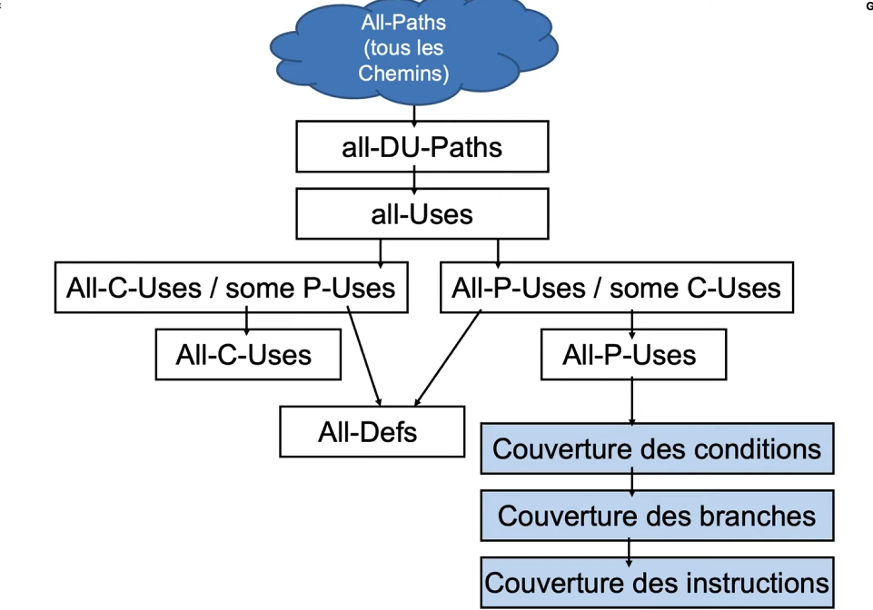

## Test en boîte blanche - Méthodes de Test et de Validation du Logiciel

### Graphe de flot de contrôle (CLG)

Graphe orienté, utilisé pour représenter le flux de contrôle d'un programme.

**Exemple** :


## Type de couverture

**Couverture de tous les chemins** : Couvre tous les nœuds du CLG. Sauf que c'est très long et coûteux en temps, voir impossible pour des programmes complexes.

**Couverture des instructions** : Couvre toutes les instructions du programme (en gros c'est notre 100% code coverage).

**Couverture des branches** : Couvre toutes les branches du programme.

Branch coverage = # de branches couvertes / # de branches totales

**Couverture des conditions (ou de décisions)** : Couvre toutes les conditions du programme.

Condition coverage = # de conditions couvertes (true/false) / # de conditions totales

**MC/DC (Multiple Condition/Decision Coverage)** : Couvre toutes les combinaisons de conditions. En gros, on fixe toutes les variables sauf une et on vérifie que toutes les combinaisons sont testées.

### Hiérarchie des tests


## Graph de flot de données (DLG)

Se concentre sur les points où les entrées et les sorties sont utilisées.


### Les tests de flot de données

**DEF(i)** : Affectation d'une variable

**USE(i)** : Utilisation d'une variabble
  - **P-USE(i)** : Predicate Use (Utilisation d'une variable dans une condition par exemple)
  - **C-USE(i)** : Computation Use (Utilisation d'une variable dans une expression (comme une addition, une multiplication, etc.))

**Les chemins DEF-USE** : 
- **Definition-Clear DC-PATH(v,n,m)** : C'est un tracé (chemin) qui va du noeud DEF(v,n) *en gros la zone où la variable v est définie* au noeud USE(v,m) *en gros la zone où la variable v est utilisée*.
  - **v** : Variable d'intérêt
  - **n** : Le noeud DEF(v,n) initial
  - **m** : Le noeud USE(v,m) final
      - Aucun autre noeud n dans le chemin est un noeud de définition pour la variable v.
- **Definition-Use DU-PATH(v,n,m)** :
  - **v** : Variable d'intérêt
  - **n** : Le noeud DEF(v,n) initial
  - **m** : Le noeud USE(v,m) final
      - Il <u>**peut**</u> y avoir d'autres noeuds de définition pour la variable v entre n et m.

**Les différents cas**: 

- **All-Defs**: Un jeu de tests T satisfait le critère All-Defs pour le programme P si et uniquement si pour chaque variable veV, il y a au moins un chemin définition-clear pour chaque noeud de définition de v. **Couverture de tous les noeuds DEF en utilisant des definitions-clear**
- **All-Uses**: Un jeu de tests T satisfait le critère All-Uses pour le programme P si et uniquement si pour chaque variable veV, il y a au moins un chemin définition-clear à partir de chaque noeud de définition de v et vers chaque noeud d'utilisation de v. Couverture de tous les noeuds DEF et tous les noeuds USE en utilisant des definitions clear (on couvre les defs et les uses, donc + gros que all-defs).

- **All-P-Uses/Some-C-Uses**: Si pour chaque variable veV, il y a au moins un chemin definition clear: 
  - Partant de chaque noeud de définition de v à chaque utilisation-prédicat de v, ou
  - Si une définition de v n'est pas utilisé dans un prédicat, il y a au moins un chemin définition clear vers une utilisation de calcul.
  **Critère: couverture de tous les noeuds DEF(v,n) et tous les noeuds P-USE(v,n) (et quelques C-USE)**

- **All-C-Uses/Some-P-Uses**: Si pour chaque variable veV, il y a au moins un chemin definition clear: 
  - Partant de chaque noeud de définition de v à chaque utilisation-calcul de v, ou 
  - Si une définition de v n'est pas utilisé dans un calcul, il y a au moins un chemin définition clear vers une utilisation de prédicat.
  **Critère: couverture de tous les noeuds DEF(v,n) et tous les noeuds C-USE(v,n) (et quelques P-USE)**

- **All-DU-Paths**: Un jeu de tests T satisfait le critère All-DU-Paths pour le programme P si et uniquement si pour chaque variable veV, on passe par tous les chemins définition-clear: 
  - Partant de chaque noeud de définition de v à chaque noeud d'utilisation de v atteignable, et
  - Que ces chemins soit des traverses simples de boucles (i.e. une itération) ou qu'ils ne passent pas dans la boucle du tout (i.e. zéro itération).
  **Critère: couverture de toutes les paires possibles de definition-use (DU)** (En gros c'est le big boss, très lourd).





### Exemple

```py
def factorial(n): 
  res = 1 # DEF(i)
  for i in range(1, n + 1):
    res = res * i # USE(i) en premier et DEF(i) en second
  return res # C-USE(i) et il y a aussi un KILL Node qui enlever la référence à res.
```

**DC-PATH(n, 1, 4)**: Il y a aucune redéfinition de n entre le noeud 1 et le noeud 4.
**DU-PATH(res, 2, 7)**: Il y a une redéfinition de res entre le noeud 2 et le noeud 7.

