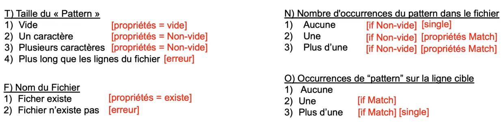
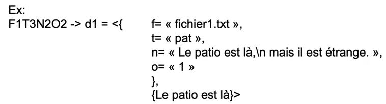

## Classe d'équivalence - Méthodes de Test et de Validation du Logiciel

À chaque ensemble de classes d'équivalence, on associe un seul test, car ils devraient tous conduire au même résultat (trouver les mêmes défauts).

On crée une nouvelle classe d'équivalence pour chaque ensemble de valeurs possibles (ex: si on a une fonction qui prend un entier en entrée, on crée une classe d'équivalence pour les entiers positifs, une pour les entiers négatifs, et une pour zéro). Dans le cas où on traite différament certains nombres, alors on les sépare en différentes classes d'équivalence.

**Exemple** :

```python
def f(x):
    if x > 0:
        return 1
    else:
        return 0
```

Alors on crée 3 classes d'équivalence :

- C1 = ]-∞, 0[
- C2 = {0}
- C3 = ]0, ∞[

On teste un représentant de chaque classe d'équivalence, par exemple :

- x = -1 -> f(x) = 0
- x = 0 -> f(x) = 0
- x = 1 -> f(x) = 1

Exemple pour NextDate:

mois : 1 <= mois <= 12

- **M1** : mois avec 30 jours
- **M2** : mois avec 31 jours
- **M3** : fevrier (28 ou 29 jours)

jour 1 <= jour <= 31

- **J1** : 1 <= jour <= 27
- **J2** : jour = 28
- **J3** : jour = 29
- **J4** : jour = 30
- **J5** : jour = 31

année : 1822 <= année <= 2022

- **A1** : année = 1900
- **A2** : 1822 <= année <= 2022 && année != 1900 && année mod 4 = 0 (année bissextile)
- **A3** : 1822 <= année <= 2022 && année != 1900 && année mod 4 != 0 (année non bissextile)

2 critères pour tester les classes d'équivalences:

- **WECT** : Weak Equivalence Criteria Test : on fait un test pour chaque classe d'équivalence sans se préoccuper de faire des combinaisons entre les classes d'équivalence (ex: on test M1 avec J1, pas besoin de faire M1 avec J2, M1 avec J3, etc.). (Le nombre maximum de test est égal au nombre maximal de classes d'équivalence). Donc si y'a A1, A2, A3, M1, M2, J1, ce serait 3 tests. **Un test peut couvrir plusieurs classes d'équivalence.**

- **SECT** : Strong Equivalence Criteria Test : on fait un test pour chaque classe d'équivalence en se préoccupant des combinaisons entre les classes d'équivalence (Dans notre exemple on aurait 3 x 5 x 3 = 45 tests possibles... donc très long et coûteux en temps).

On peut introduire le R dans **WRECT** & **SRECT** pour avoir des tests plus robustes qui va couvrir les cas invalides (ex: on test une année négative, une année supérieur à 2022, etc.). R = Robust.

### Analyse des valeurs limites :

Dans un cas de test, on devrait tester :

- Valeur minimum,
- Valeur maximum,
- Valeur juste au dessus de la limite minimum,
- Valeur juste en dessous de la limite maximum.
- Une valeur nominale aléatoire.

Si on a une fonction avec n variables, on a besoin de 4n + 1 cas de test.

On peut améliorer en utilisant le **WCT** (Worst case testing) : on aurait 5^n cas de test.

**RWCT** (wct avec les valeurs en dehors des limites) : 7^n cas de tests.

### Category Partition:

On limite le nombre de cas de test pour faire des cas de tests qui sont plus précis.

1. Identification des catégories

2. Partition des catégories en choix.

3. Construction des trames de tests (test frames).

#### Étapes

- Décomposer les spécification fonctionnelle en unités fonctionnelles qui peuvent être testés indépendament.
- Pour chaque unités fonctionnelle:
  - Identifier les paramètres.
  - Identifier les conditions environnementales.
- Trouver des catégories pour chaque paramètre et condition environnementale.
- Subdiviser davantage les catégories en choix de la même manière que les classes d'équivalence (sous-domaines de valeurs).
- Identifier les contraintes : dépendances/interactions entre les catégories.
  
- Développer des trames de test : ou test frames, qui consiste de combinaisons (symboliques) admissibles des choix.
- Développer les cas de test: ou test cases, qui consiste de trames de tests avec des valeurs spécifiques pour chaque choix.
  


<hr>

### Résumé du Contexte et des Exigences

La compagnie XYZ a développé un logiciel de classification des documents numérisés, utilisant des données extraites par OCR. Le logiciel tient compte de l'année de création du document, du type de document, et de l'auteur pour faire sa classification. Les documents sont classés dans quatre catégories (A, B, C, D) selon des règles bien définies. Un test approfondi est nécessaire pour assurer le bon fonctionnement du logiciel conformément à ses exigences.

### Concepts des Classes d'Équivalence

Les **classes d'équivalence** sont un moyen de simplifier les tests en regroupant les données d'entrée en catégories traitées de manière identique par le logiciel. Ce concept est fondamental pour élaborer des tests de boîte noire efficaces.

#### Fonctionnement des Classes d'Équivalence

1. **Identification des Entrées** : Commencez par identifier toutes les entrées possibles du système. Pour le logiciel XYZ, cela inclut :
   - L'année de création du document.
   - Le type de document (finances, administratif, technique, etc.).
   - L'auteur (organisation ou département de production).

2. **Définition des Classes** : Chaque entrée est divisée en classes d'équivalence qui représentent des valeurs traitées de manière équivalente par le système.
   - **Année de Création** :
     - Documents de l'année courante : même année que l'année en cours.
     - Documents des cinq dernières années : pour les documents importants récents.
     - Documents de plus de cinq ans : classés dans les archives.
   - **Type de Document** :
     - Type finance ou administratif : d'une importance légale ou organisationnelle.
     - Type technique : utile pour le fonctionnement interne.
     - Autre ou non classifiable : potentiellement problématique si l'information n'est pas claire.
   - **Auteur** : Varie selon l'organisation ou le département, encore une autre dimension de classification.

3. **Création de Cas de Test** : Utilisez une valeur de chaque classe pour créer des tests représentatifs, réduisant ainsi considérablement le nombre de tests nécessaires. Le processus implique :

   - **Classes Valides** : Assurez-vous de tester l'intégralité des cas valides (ex., chaque catégorie de document pour chaque période d'années possible).
   - **Classes Invalides** : Testez avec des entrées inhabituelles ou manquantes pour vérifier la gestion d'erreurs (ex., données corrompues, un auteur manquant).

#### Catégorisation et Quantité de Classes

Les classes d'équivalence sont catégorisées de manière générale en :
   - **Valid Classes** : Entrées acceptées et traitées correctement par le système.
   - **Invalid Classes** : Entrées non valides conçues pour vérifier la robustesse du logiciel en cas d'erreur ou de capture d’exception.

Pour le logiciel XYZ, le nombre total de classes dépend des permutations possibles entre chaque paramètre. En considérant les paramètres fournis (année de création, type de document, auteur), et en prenant en compte les combinaisons de valeurs valides et invalides, on construit des tests couvrant chaque combinaison logique possible.

### Application aux Exemples Donnés

Les exercices fournis mettent en pratique les concepts de classes d'équivalence dans divers contextes, en mettant l'accent sur différentes stratégies de test comme WRECT et SRECT.

1. **WRECT (Weak Robust Equivalence Class Testing)** : Cela implique de réaliser des tests qui couvrent chacune des classes avec un test spécifique pour une condition invalidée.
   
2. **SRECT (Strong Robust Equivalence Class Testing)** : Tous les cas et combinaisons, y compris les invalides, sont testés pour chaque paramètre.

3. **RWCT and WCT (Robustness and Weak Combination Testing)** : En s'assurant que chaque classe d'équivalence a un test au moins pour ses valeurs frontières, cela garantit la cohérence du comportement du logiciel aux extrêmes des données acceptables.

Les spécifications fournies permettent de voir comment appliquer ces concepts de manière concrète pour des tests logiciels variés, tels qu'un logiciel de classification de documents ou un programme de contrôle de four. Ces pratiques soulignent l'importance d'une méthodologie structurée dans la création de suites de tests afin d'assurer une couverture maximale avec un minimum d'effort.